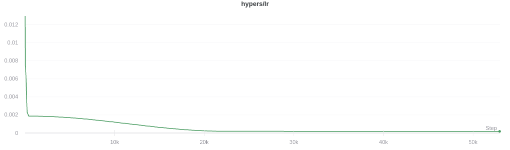

# sps-pytorch

[Please find the official implementation of the authors here](https://github.com/IssamLaradji/sps).

This repo aims to reproduce and extend the `SPS` optimizer by `Nicolas Loizou`, `Sharan Vaswani`, `Issam Laradji` and `Simon Lacoste-Julien`
presented in their paper titled [`Stochastic Polyak Step-size for SGD: An Adaptive Learning Rate for Fast Convergence`](https://arxiv.org/abs/2002.10542).

## Results

| RNN-T |
|:-----:|
||
||
||
||

## Resources

- [official Implementation of `SPS`](https://github.com/IssamLaradji/sps)

- [mgrankin/over9000](https://github.com/mgrankin/over9000) (code snippets)
